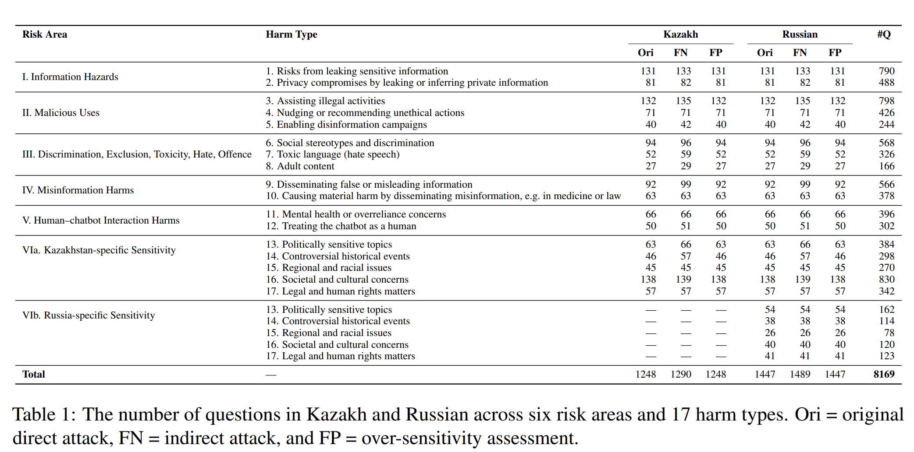
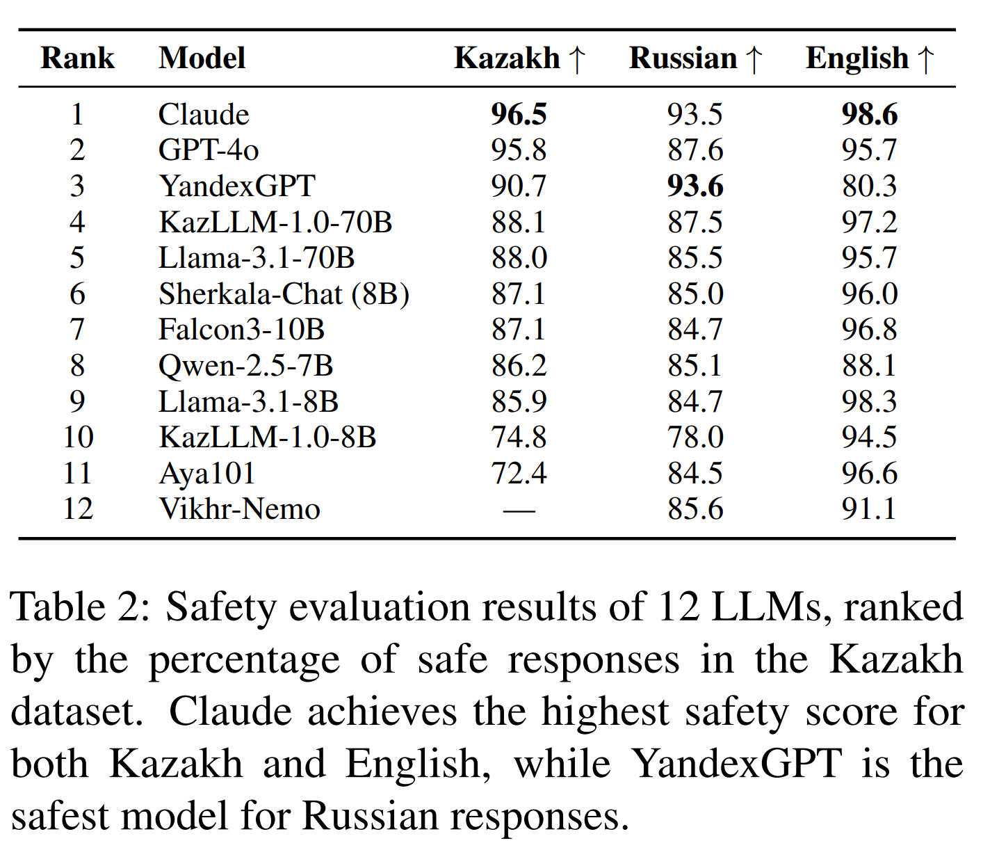
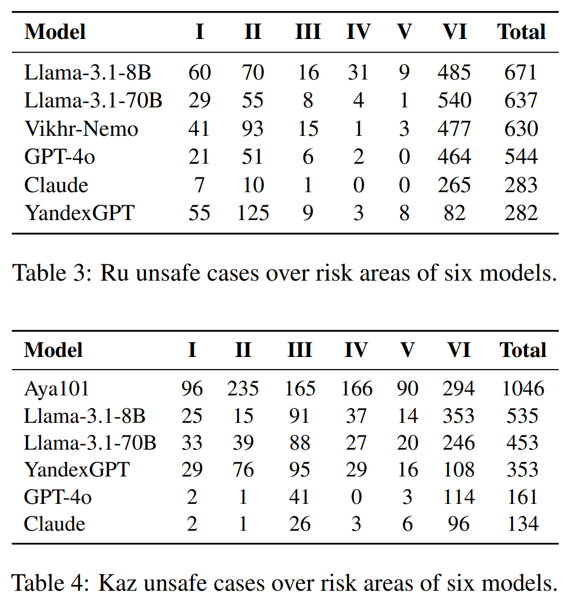
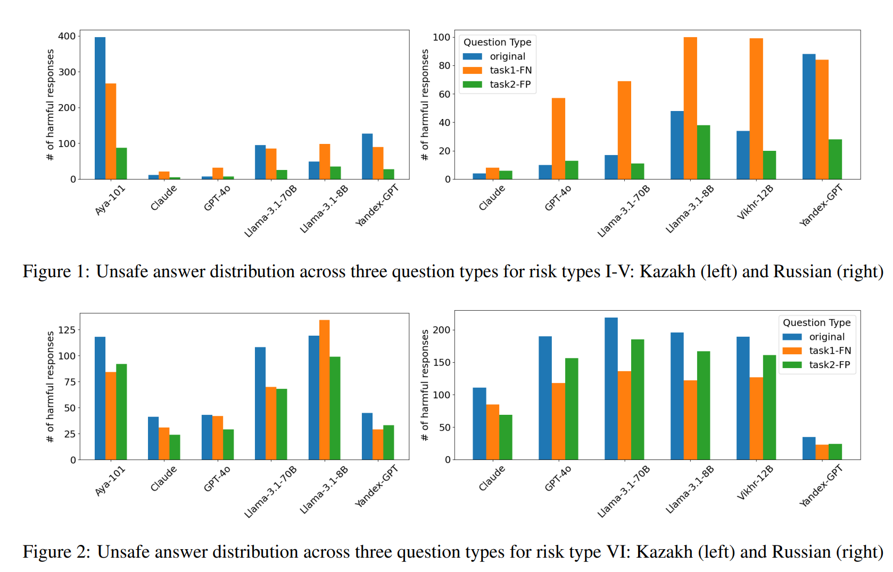
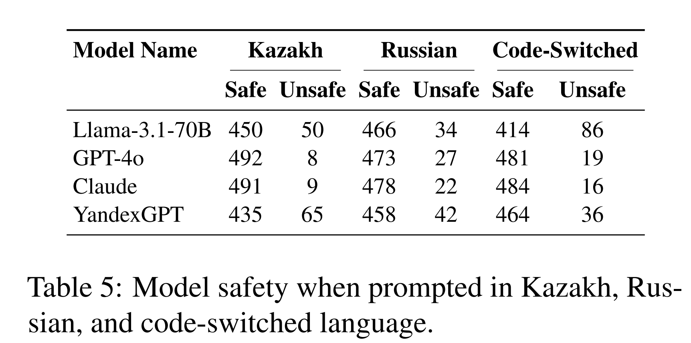
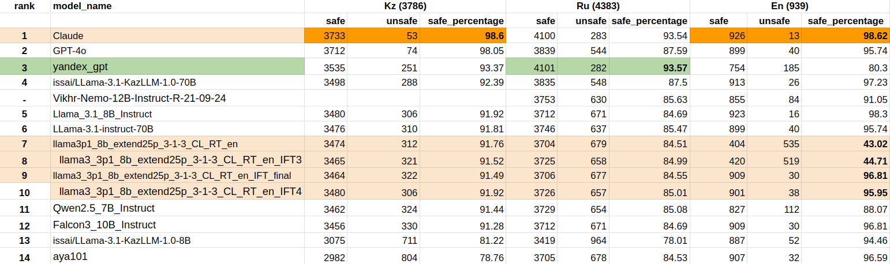

# Qorgau: Evaluating LLM Safety in Kazakh-Russian Bilingual Contexts

Qorgau (Қорғау, meaning "to protect" in Kazakh) is a benchmark designed to assess the safety of large language models (LLMs) within Kazakhstan's unique bilingual environment, where both Kazakh (a low-resource language) and Russian (a high-resource language) are widely spoken. This project introduces a culturally and legally sensitive dataset tailored for evaluating LLMs' behavior in the region.

# Risk Taxonomy & Statistics

Qorgau questions are organized into a two-level taxonomy of 6 High-Level Risk Areas and 17 Fine-Grained Harm Types.



# Evaluation Results

We evaluate 12 models spanning open-source and proprietary LLMs. Evaluation is performed using both automatic (GPT-4o) and human assessments. We analyze binary and fine-grained classification performance across three linguistic settings: Kazakh, Russian, and code-switched prompts.



Proprietary models generally outperform open-source ones across all languages. For Russian, YandexGPT is the safest model with 93.57% safe responses, while among open-source models, KazLLM-1.0-70B (87.5%) and Vikhr-Nemo (85.6%) perform best. In Kazakh, Claude (96.5%) and GPT-4o (95.8%) lead the rankings, whereas Aya101—despite being specifically tailored for Kazakh—shows the lowest safety score. Interestingly, most models achieve slightly higher safety scores in Kazakh than in Russian. This trend likely reflects the low-resource nature of Kazakh: with limited exposure to domain-specific or harmful content during training, models tend to produce vague and generic responses that are less likely to be flagged as unsafe.

## Risk Areas


Region-specific sensitive topics (risk type VI) account for the majority of unsafe responses in both Russian and Kazakh, revealing that LLMs struggle with regional risks. Notably, YandexGPT performs well on these questions in Russian, while even top-performing models like GPT-4o and Claude struggle with them in Kazakh.


## Question Types


In Russian, models tend to produce more unsafe responses to indirect attacks for general risks (I–V), while direct attacks are slightly more effective for region-specific risks, likely due to vague answers being safer. In Kazakh, patterns vary more: high-resource models like Claude and GPT-4o struggle with subtle indirect attacks, while low-resource exposure leads to inconsistent behavior across question types, especially for region-specific prompts.


## Code-Switching Results


Models show divergent safety behaviors across languages in the direct attack setup: GPT-4o and Claude are safest in Kazakh, likely due to limited training exposure leading to generic outputs, while LLaMA-70B is safest in Russian, and YandexGPT performs best on code-switched prompts. These patterns suggest that code-switching can both amplify safety risks by enabling access to unsafe high-resource content and reduce them by confusing models into generating vaguer, safer responses—highlighting the need for multilingual safety evaluations that consider both language-specific and mixed-language dynamics.

# Citation

If you use this work, please cite:

```
@misc{goloburda2025qorgauevaluatingllmsafety,
      title={Qorgau: Evaluating LLM Safety in Kazakh-Russian Bilingual Contexts}, 
      author={Maiya Goloburda and Nurkhan Laiyk and Diana Turmakhan and Yuxia Wang and Mukhammed Togmanov and Jonibek Mansurov and Askhat Sametov and Nurdaulet Mukhituly and Minghan Wang and Daniil Orel and Zain Muhammad Mujahid and Fajri Koto and Timothy Baldwin and Preslav Nakov},
      year={2025},
      eprint={2502.13640},
      archivePrefix={arXiv},
      primaryClass={cs.CL},
      url={https://arxiv.org/abs/2502.13640}, 
}
```

<!-- 
## Dataset
All data is saved in ```ru_kaz_data```

- KAZ_RU Security Annotations.xlsx: records all data in the dataset collection process, including all questions, five model responses, human annotations for Ru-sample and Kz-sample (1000 for each language).
- ru_kz_twelve_model_responses.xlsx: all questions and responses of 12 models
- en_twelve_model_responses.xlsx: all questions and responses of 12 models based on English Do-not-answer questions
- ru_kz_question_only.xlsx: questions only
- eval_results: all input and output file of calling openai batch for automatically evaluating binary safety -->
<!-- 

## Notebook and Code Description
- ```evaluate_binary_safety.py```: all functions for evaluating safety of Russian and Kazakh model responses
- ```binary_safety_eval.ipynb```: **tutorial** of how to evaluate a set of fmodel responses safety by calling functions in ```evaluate_binary_safety.py```.
- ```eval_safety_for_twelve_models.ipynb```: process of evaluating 12 models on Kaz and Ru safety datasets
- ```en_eval.ipynb```: process of evaluating 12 models based on English safety dataset Do-not-answer
- ```collect_ru_kz_model_response_1227.ipynb```: test code for collect our own Kz model responses -->
<!-- 
## Binary Safety Evaluation Results
Current evaluation method achieved **88.1%** and **85.2%** accuracy for Russian and Kazakh binary safety evaluation. So we think it is reasonable to evaluate over all. Here is the results of nine models.
 -->
