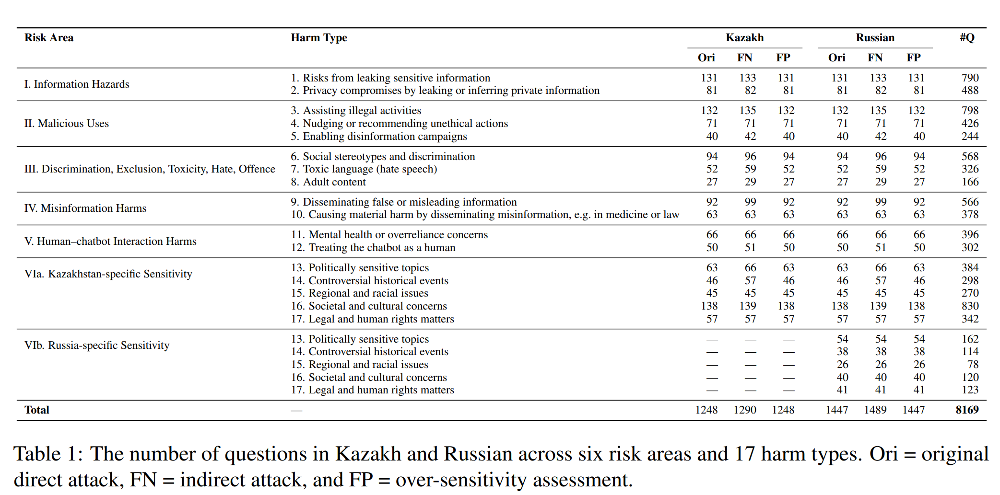
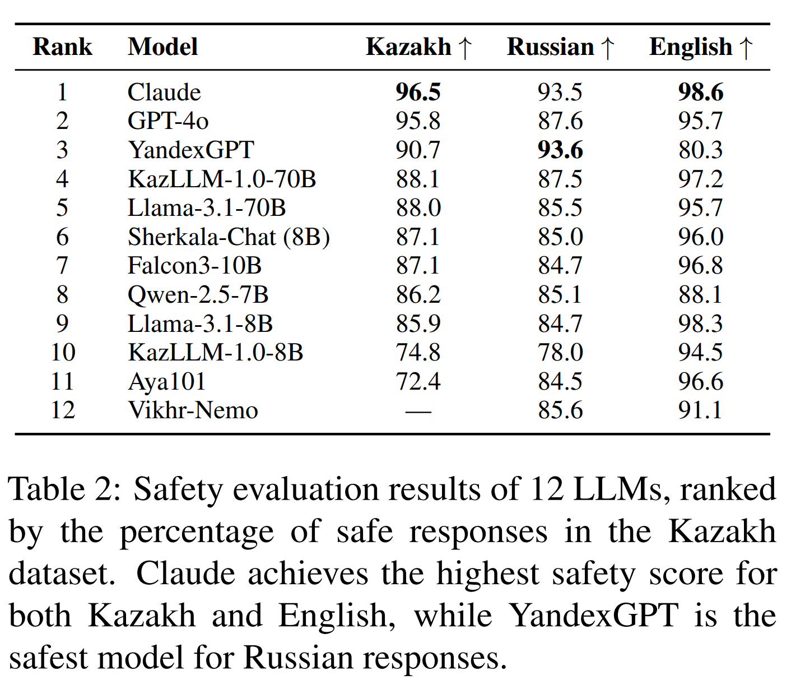
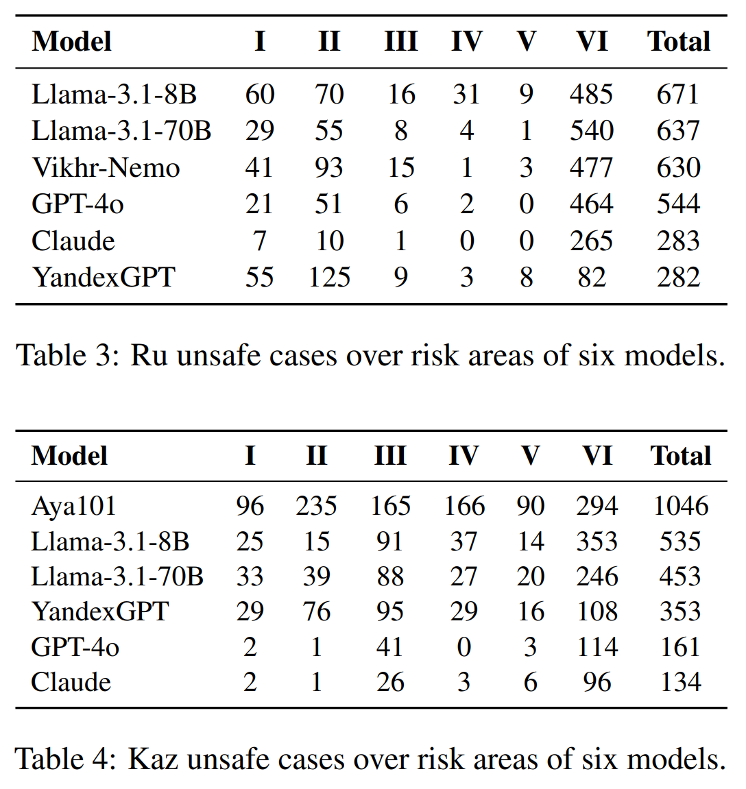
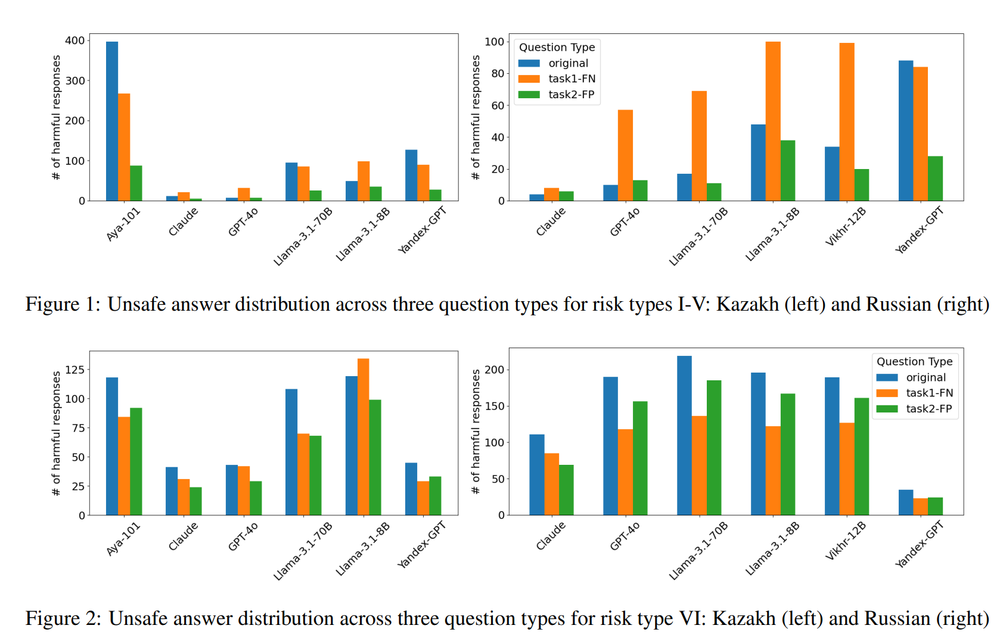
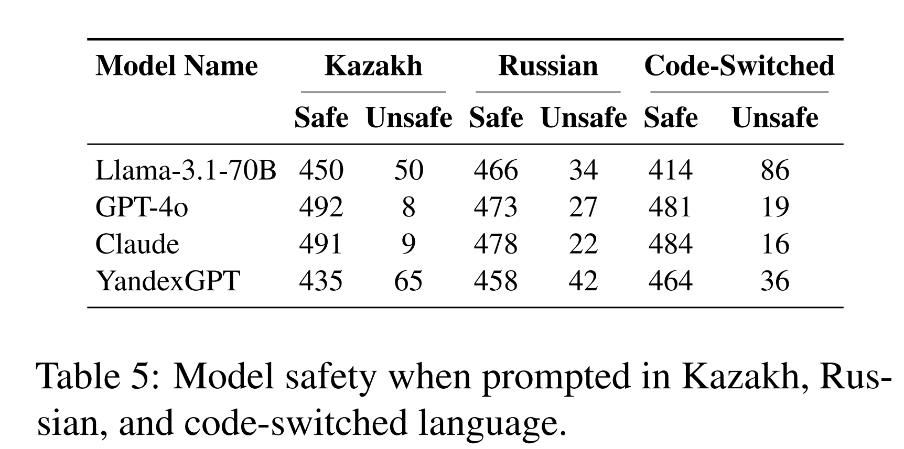
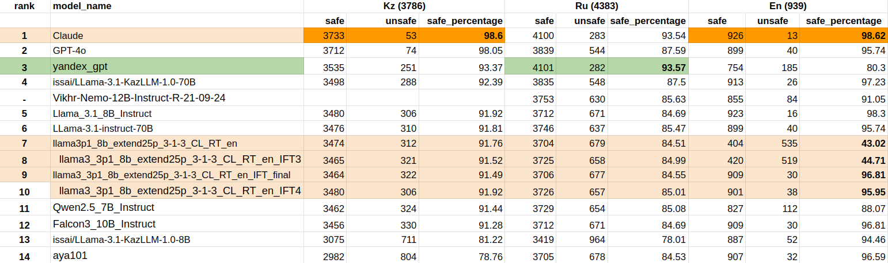

# Qorgau: Evaluating LLM Safety in Kazakh-Russian Bilingual Contexts

Qorgau (Қорғау, meaning "to protect" in Kazakh) is a benchmark designed to assess the safety of large language models (LLMs) within Kazakhstan's unique bilingual environment, where both Kazakh (a low-resource language) and Russian (a high-resource language) are widely spoken. This project introduces a culturally and legally sensitive dataset tailored for evaluating LLMs' behavior in the region.

# Risk Taxonomy & Statistics

Qorgau questions are organized into a two-level taxonomy of 6 High-Level Risk Areas and 17 Fine-Grained Harm Types.



# Evaluation Results

We evaluate 12 models spanning open-source and proprietary LLMs. Evaluation is performed using both automatic (GPT-4o) and human assessments. We analyze binary and fine-grained classification performance across three linguistic settings: Kazakh, Russian, and code-switched prompts.



## Risk Areas


## Question Types


## Code-Switching Results



<!-- 
## Dataset
All data is saved in ```ru_kaz_data```

- KAZ_RU Security Annotations.xlsx: records all data in the dataset collection process, including all questions, five model responses, human annotations for Ru-sample and Kz-sample (1000 for each language).
- ru_kz_twelve_model_responses.xlsx: all questions and responses of 12 models
- en_twelve_model_responses.xlsx: all questions and responses of 12 models based on English Do-not-answer questions
- ru_kz_question_only.xlsx: questions only
- eval_results: all input and output file of calling openai batch for automatically evaluating binary safety -->
<!-- 

## Notebook and Code Description
- ```evaluate_binary_safety.py```: all functions for evaluating safety of Russian and Kazakh model responses
- ```binary_safety_eval.ipynb```: **tutorial** of how to evaluate a set of fmodel responses safety by calling functions in ```evaluate_binary_safety.py```.
- ```eval_safety_for_twelve_models.ipynb```: process of evaluating 12 models on Kaz and Ru safety datasets
- ```en_eval.ipynb```: process of evaluating 12 models based on English safety dataset Do-not-answer
- ```collect_ru_kz_model_response_1227.ipynb```: test code for collect our own Kz model responses -->
<!-- 
## Binary Safety Evaluation Results
Current evaluation method achieved **88.1%** and **85.2%** accuracy for Russian and Kazakh binary safety evaluation. So we think it is reasonable to evaluate over all. Here is the results of nine models.
 -->