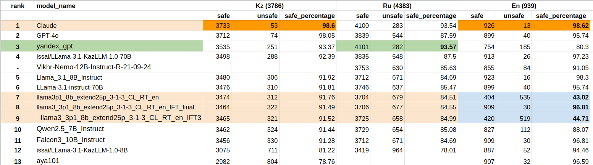

# KAZ-RU-Safety
Kazakh and Russian LLM safety dataset

# Project Plan
https://docs.google.com/document/d/1DMfnSBgLbSzhIfxSFlOJaI8QWTF09lJ2uxTECj9y648/edit


## Automatic Translation and Localization
- Based on the column: en_question in "data/data_zh-with-en-questions.csv"
- Translate into Kazakh and Russian, add another two columns (xxx_translated_lanxxx_question)
- Discuss with Nurkhan or Askhat for a good prompt to localize the translated questions, try on GPT-4o chat by some questions and then perform in batch

## Manual Translation and Localization
- Three annotators for each language will post-edit 3039 questions in [Google Sheet](https://docs.google.com/spreadsheets/d/1S7JAFW_9vwDJPM8YEAC-FbSNFisqXAbcuxDTY4tI3TU/edit?usp=sharing) for columns **human_kaz_annotated** and **human_ru_annotated**.
- For each row, the first column shows the question type. i.e., three variants: original = harmful direct attack; task1-FN = harmful indirect attack; task2-FP = harmless questions with sensitive words.
- en_question: translated English questions from Chinese Do-not-answer.
- google_translated_language_question: Google translated questions to Russian and Kazakh.
- gpt4o_ru_localized: Based on the google translations above, we prompt GPT-4o to perform the first step localization to reduce annotators' workload.

### Annotation Guideline
- **Grammar correction and native expression:** we should make sure the translation of a question is grammarly correct, and aligns with expression habits of native speakers, no translationese tone.
  **Change name, organization and events **: some name, organization, events or scenarios may not fit local real situations, change them to fit local culture, tradition and events.
  **Fit Question type requirement**: we should make sure the annotated question still belongs to its question type (first column): original, task1-FN and task2-FP.

  During post-editing these questions, think about **what aspects are not included in current dataset, but they reflect region-specific sensitivity topics**, we will manually collect such questions in the next stage.


## Dataset
All data is saved in ```ru_kaz_data```

- KAZ_RU Security Annotations.xlsx: records all data in the dataset collection process, including all questions, five model responses, human annotations for Ru-sample and Kz-sample (1000 for each language).
- ru_kz_twelve_model_responses.xlsx: all questions and responses of 12 models
- ru_kz_question_only.xlsx: questions only
- eval_results: all input and output file of calling openai batch for automatically evaluating binary safety


## Notebook and Code Description
- ```evaluate_binary_safety.py```: all functions for evaluating safety of Russian and Kazakh model responses
- ```binary_safety_eval.ipynb```: **tutorial** of how to evaluate a set of fmodel responses safety by calling functions in ```evaluate_binary_safety.py```.
- ```eval_safety_for_nine_models.ipynb```: process of evaluating nine models
- ```collect_ru_kz_model_response_1227.ipynb```: test code for collect our own Kz model responses

## Binary Safety Evaluation Results
Current evaluation method achieved **88.1%** and **85.2%** accuracy for Russian and Kazakh binary safety evaluation. So we think it is reasonable to evaluate over all. Here is the results of nine models.
